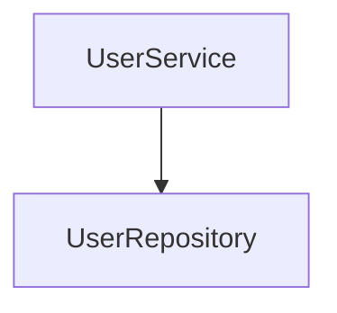
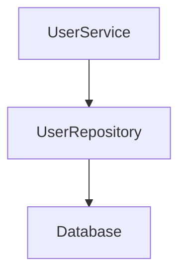
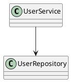

# Idiomatic Architecture Viewer

Interactive architecture analysis and visualization tool for Kotlin projects powered by KSP (Kotlin Symbol Processing).

The project analyzes Kotlin source code during compilation and generates:

- interactive HTML architecture viewer
- package navigation pages
- class dependency pages
- Mermaid dependency graphs
- PlantUML diagrams
- architecture metrics
- dependency cycle reports
- JSON architecture export

The generated reports allow exploring project structure directly in the browser.

---

# Features

## Architecture Analysis

- class dependency analysis
- constructor dependency detection
- method dependency analysis
- package structure analysis
- module detection
- sourceSet detection
- architecture layer detection
- dependency cycle detection

---

## Interactive HTML Viewer

The project generates a full interactive architecture website.

Includes:

- architecture overview page
- package pages
- class pages
- clickable dependency navigation
- Mermaid dependency graphs
- package explorer
- class dependency explorer

---

## Diagram Generation

Supported outputs:

- PlantUML
- Mermaid
- HTML
- JSON
- Markdown reports

---

## Metrics & Reports

The library generates:

- architecture metrics
- class metrics
- dependency cycle reports
- architecture graphs
- module dependency diagrams

---

# Example

## Input

```kotlin
@UmlDiagram
class UserService(
    private val repository: UserRepository
)
```

---

## Generated Dependency Graph



---

## Generated HTML Viewer

The processor automatically generates:

```text
architecture.html
architecture-snapshot.json
com_example_service.html
UserService.html
```

with interactive navigation between pages.

Large graphs include a few navigation helpers:

- the project tree can be resized horizontally, and long items expose full names on hover;
- layer badges explain `presentation`, `domain`, `data`, and `core` in the viewer;
- graph nodes can be dragged manually without recalculating the whole layout;
- while dragging a node, its directly connected visible nodes are gently pulled with it;
- `Fit Selection` zooms to the selected symbol and its visible dependencies;
- `Neighbors` moves visible dependencies of the selected symbol closer, which helps inspect long edges in large projects;
- `Reset Layout` restores the generated auto-layout.

---

# Generated Output

## Architecture Overview

- project structure visualization
- module overview
- package navigation
- dependency graph

## Package Pages

Each package page contains:

- package classes
- dependency graph
- navigation between classes

## Class Pages

Each class page contains:

- dependencies
- methods
- properties
- Mermaid graph
- clickable dependency links

---

# Architecture

```text
Kotlin Source Code
        │
        ▼
KSP Processor
        │
        ▼
Static Code Analysis
        │
        ├── Dependency Analysis
        ├── Package Analysis
        ├── Module Detection
        ├── Metrics
        └── Cycle Detection
        │
        ▼
Generators
        │
        ├── HTML
        ├── PlantUML
        ├── Mermaid
        ├── JSON
        └── Markdown Reports
        │
        ▼
Generated Architecture Viewer
```

---

# Technologies

- Kotlin
- KSP (Kotlin Symbol Processing)
- Mermaid.js
- PlantUML
- Gradle
- Kotlin Serialization
- OkHttp

---

# Project Structure

```text
idiomatic-architecture-viewer
│
├── processor
│
├── analysis
│   ├── CycleDetector
│   └── ArchitectureAnalysis
│
├── diagram
│   ├── ArchitectureGraphGenerator
│   ├── PackageDiagramGenerator
│   ├── MetricsReportGenerator
│   └── ModuleDiagramGenerator
│
├── export
│   ├── ArchitectureHtmlExporter
│   ├── PackageHtmlExporter
│   ├── ClassHtmlExporter
│   └── ArchitectureJsonExporter
│
├── generation
│   ├── HtmlGenerationService
│   ├── DiagramGenerationService
│   ├── JsonGenerationService
│   └── UmlClassGenerationService
│
├── metrics
│
├── uml
│
├── writer
│
├── build.gradle.kts
└── settings.gradle.kts
```

---

# Installation

The annotation API is intentionally small. In source code you always use the
same annotation:

```kotlin
import uml.UmlDiagram

@UmlDiagram
class UserService

@UmlDiagram
fun UserScreen() {
}
```

The Gradle setup is different for JVM-only and Kotlin Multiplatform projects.
Use the same `VERSION` for all Idiomatic Architecture Viewer artifacts.

## JVM Project

```kotlin
plugins {
    kotlin("jvm")
    id("com.google.devtools.ksp")
}

dependencies {
    implementation(
        "io.github.nastyoonaa:idiomatic-architecture-viewer:VERSION"
    )

    ksp(
        "io.github.nastyoonaa:idiomatic-architecture-viewer-processor:VERSION"
    )
}
```

## Kotlin Multiplatform Project

Use the multiplatform annotations artifact from `commonMain`. The KSP processor
still runs only during Gradle compilation.

```kotlin
plugins {
    kotlin("multiplatform")
    id("com.android.library")
    id("com.google.devtools.ksp")
}

kotlin {
    androidTarget()
    iosX64()
    iosArm64()
    iosSimulatorArm64()

    sourceSets {
        commonMain.dependencies {
            implementation(
                "io.github.nastyoonaa:idiomatic-architecture-viewer-annotations:VERSION"
            )
        }
    }
}

dependencies {
    add(
        "kspCommonMainMetadata",
        "io.github.nastyoonaa:idiomatic-architecture-viewer-processor:VERSION"
    )

    add(
        "kspAndroid",
        "io.github.nastyoonaa:idiomatic-architecture-viewer-processor:VERSION"
    )

    add(
        "kspIosX64",
        "io.github.nastyoonaa:idiomatic-architecture-viewer-processor:VERSION"
    )

    add(
        "kspIosArm64",
        "io.github.nastyoonaa:idiomatic-architecture-viewer-processor:VERSION"
    )

    add(
        "kspIosSimulatorArm64",
        "io.github.nastyoonaa:idiomatic-architecture-viewer-processor:VERSION"
    )
}
```

For Kotlin Multiplatform, the generated static viewer appears under the KSP
output of each target, for example:

```text
build/generated/ksp/metadata/commonMain/resources/com/example/generated/architecture/architecture.html
build/generated/ksp/android/androidDebug/resources/com/example/generated/architecture/architecture.html
build/generated/ksp/iosX64/iosX64Main/resources/com/example/generated/architecture/architecture.html
build/generated/ksp/iosSimulatorArm64/iosSimulatorArm64Main/resources/com/example/generated/architecture/architecture.html
```

---

# Usage

Annotate classes, objects, interfaces, or top-level functions:

```kotlin
import uml.UmlDiagram

@UmlDiagram
class UserService(
    private val repository: UserRepository
)

@UmlDiagram
fun UserScreen(
    service: UserService
) {
}
```

Top-level functions are shown as function nodes in `architecture.html`. This
also works for Compose functions and KMP `expect`/`actual` functions when they
are visible to the KSP task being executed.

Import dependencies are also shown. If an annotated class or function imports a
project class that is not annotated, the viewer can still create an imported
class node and render the dependency.

Build the project:

```bash
./gradlew build
```

Generated files will appear in:

```text
build/generated/ksp/
```

Open `architecture.html` in a browser to inspect the generated static viewer.

---

# Architecture Snapshots

The processor also generates `architecture-snapshot.json`. Keep this file from
a previous build if you want to compare it with a newer architecture report.

Typical flow:

1. Generate the viewer for the current version of your project.
2. Save `architecture-snapshot.json` somewhere safe, for example in CI
   artifacts or release artifacts.
3. After architecture changes, generate a new `architecture.html`.
4. Open the new `architecture.html`.
5. Click `Snapshot`.
6. Load the older `architecture-snapshot.json`.

The viewer will compare the old snapshot with the current full graph and show:

- added and removed nodes
- added and removed dependencies
- nodes and dependency count changes
- cycle count changes
- architecture violation count changes

Snapshot comparison uses the serialized architecture model, not the current UI
state. Filters, selected nodes, zoom, and layout changes do not affect the
snapshot diff.

The snapshot file has this shape:

```json
{
  "schemaVersion": 1,
  "generatedBy": "idiomatic-architecture-viewer",
  "data": {
    "nodes": [],
    "edges": [],
    "tree": [],
    "summary": {},
    "report": {}
  }
}
```

If the snapshot schema is unsupported or the file is invalid, the viewer shows
an error and keeps the current architecture graph unchanged.

---

# Optional Call Graph Overlay

The static viewer can also load an optional call graph layer from an external
`architecture-callgraph.json` file.

This is intentionally separate from the KSP structural graph. The default KSP
processor stays lightweight and continues to generate only structural
architecture data such as declarations, imports, constructors, properties,
method parameters, return types, and inheritance.

Typical flow:

1. Generate or obtain an `architecture-callgraph.json` file from an external
   call graph analyzer.
2. Open `architecture.html`.
3. Click `Call Graph`.
4. Load `architecture-callgraph.json`.
5. Enable or disable the `Call` edge type in the toolbar.

The viewer merges the call graph layer in memory only:

- base `ViewerData` is not modified
- base node identity is not recalculated
- base edge identity is not recalculated
- `architecture-snapshot.json` is not modified
- snapshot diff and call graph overlay are fully independent systems

The minimal call graph file shape is:

```json
{
  "schemaVersion": 1,
  "generatedBy": "idiomatic-architecture-viewer-callgraph",
  "nodes": [
    {
      "id": "com.example.UserViewModel.loadUser()",
      "label": "UserViewModel.loadUser()",
      "pkg": "com.example",
      "module": "app",
      "sourceSet": "commonMain",
      "file": "UserViewModel.kt",
      "kind": "function",
      "layer": "presentation"
    }
  ],
  "edges": [
    {
      "from": "com.example.UserViewModel.loadUser()",
      "to": "com.example.GetUserUseCase.invoke()",
      "type": "call",
      "context": "method-body",
      "snippet": "getUserUseCase.invoke()"
    }
  ]
}
```

Only the minimum graph data is loaded. The viewer does not store AST, IR,
method bodies, runtime traces, reflection data, or compiler dumps in the
snapshot.

Unknown call targets can be represented with stable unresolved ids:

```text
unresolved:call:externalAnalytics.trackImport
```

Call graph support is a visualization overlay. It does not currently make the
KSP processor perform semantic method-body analysis.

For demos, present this as a prepared extension point rather than a completed
semantic call graph analyzer:

- the main viewer demonstrates structural architecture analysis
- import dependencies are part of the generated base graph
- call graph data is loaded as an optional overlay
- the overlay does not affect base graph identity or snapshot diff
- a future compiler-level analyzer can produce `architecture-callgraph.json`

---

# Generated Files

Examples:

```text
architecture.html
architecture.json
architecture-snapshot.json
ArchitectureOverview.puml
ArchitectureMetrics.md
DependencyCycles.md
ArchitectureGraph.puml
com_example_service.html
UserService.html
```

---

# Mermaid Example



---

# PlantUML Example



---

# Roadmap

Planned features:

- IntelliJ IDEA plugin
- Android Studio plugin
- live architecture updates
- architecture diff reports
- CI/CD integration
- architectural rule validation
- graph filtering
- dark mode viewer
- graph clustering
- AI-powered architecture recommendations

---

# Publishing

Artifacts are published to Maven Central.

Published artifacts:

```text
io.github.nastyoonaa:idiomatic-architecture-viewer
io.github.nastyoonaa:idiomatic-architecture-viewer-processor
io.github.nastyoonaa:idiomatic-architecture-viewer-annotations
```

Release CI validates the project first and then publishes all configured
Maven Central publications.

---

# Author

Anastasia Tsipenyuk

GitHub:
https://github.com/Nastyoonaa

Telegram:
@Iydyshka_krovopivyshka
