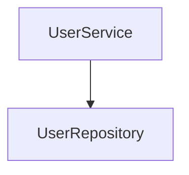
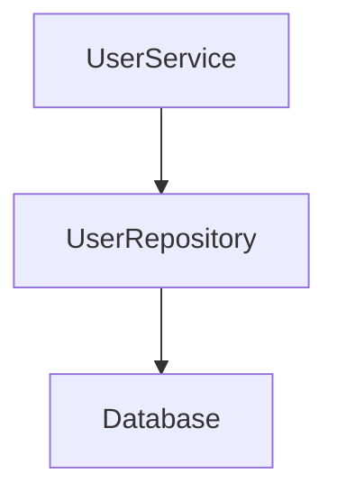
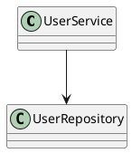

# Idiomatic Architecture Viewer

Interactive architecture analysis and visualization tool for Kotlin projects powered by KSP (Kotlin Symbol Processing).

The project analyzes Kotlin source code during compilation and generates:

- interactive HTML architecture viewer
- package navigation pages
- class dependency pages
- Mermaid dependency graphs
- PlantUML diagrams
- architecture metrics
- dependency cycle reports
- JSON architecture export

The generated reports allow exploring project structure directly in the browser.

---

# Features

## Architecture Analysis

- class dependency analysis
- constructor dependency detection
- method dependency analysis
- package structure analysis
- module detection
- sourceSet detection
- architecture layer detection
- dependency cycle detection

---

## Interactive HTML Viewer

The project generates a full interactive architecture website.

Includes:

- architecture overview page
- package pages
- class pages
- clickable dependency navigation
- Mermaid dependency graphs
- package explorer
- class dependency explorer

---

## Diagram Generation

Supported outputs:

- PlantUML
- Mermaid
- HTML
- JSON
- Markdown reports

---

## Metrics & Reports

The library generates:

- architecture metrics
- class metrics
- dependency cycle reports
- architecture graphs
- module dependency diagrams

---

# Example

## Input

```kotlin
@UmlDiagram
class UserService(
    private val repository: UserRepository
)
```

---

## Generated Dependency Graph



---

## Generated HTML Viewer

The processor automatically generates:

```text
architecture.html
com_example_service.html
UserService.html
```

with interactive navigation between pages.

---

# Generated Output

## Architecture Overview

- project structure visualization
- module overview
- package navigation
- dependency graph

## Package Pages

Each package page contains:

- package classes
- dependency graph
- navigation between classes

## Class Pages

Each class page contains:

- dependencies
- methods
- properties
- Mermaid graph
- clickable dependency links

---

# Architecture

```text
Kotlin Source Code
        │
        ▼
KSP Processor
        │
        ▼
Static Code Analysis
        │
        ├── Dependency Analysis
        ├── Package Analysis
        ├── Module Detection
        ├── Metrics
        └── Cycle Detection
        │
        ▼
Generators
        │
        ├── HTML
        ├── PlantUML
        ├── Mermaid
        ├── JSON
        └── Markdown Reports
        │
        ▼
Generated Architecture Viewer
```

---

# Technologies

- Kotlin
- KSP (Kotlin Symbol Processing)
- Mermaid.js
- PlantUML
- Gradle
- Kotlin Serialization
- OkHttp

---

# Project Structure

```text
idiomatic-architecture-viewer
│
├── processor
│
├── analysis
│   ├── CycleDetector
│   └── ArchitectureAnalysis
│
├── diagram
│   ├── ArchitectureGraphGenerator
│   ├── PackageDiagramGenerator
│   ├── MetricsReportGenerator
│   └── ModuleDiagramGenerator
│
├── export
│   ├── ArchitectureHtmlExporter
│   ├── PackageHtmlExporter
│   ├── ClassHtmlExporter
│   └── ArchitectureJsonExporter
│
├── generation
│   ├── HtmlGenerationService
│   ├── DiagramGenerationService
│   ├── JsonGenerationService
│   └── UmlClassGenerationService
│
├── metrics
│
├── uml
│
├── writer
│
├── build.gradle.kts
└── settings.gradle.kts
```

---

# Installation

## Gradle

```kotlin
plugins {
    kotlin("jvm")
    id("com.google.devtools.ksp")
}

dependencies {

    implementation(
        "io.github.nastyoonaa:idiomatic-architecture-viewer:0.1.0"
    )

    ksp(
        "io.github.nastyoonaa:idiomatic-architecture-viewer-processor:0.1.0"
    )
}
```

---

# Usage

Annotate classes:

```kotlin
@UmlDiagram
class UserService(
    private val repository: UserRepository
)
```

Build the project:

```bash
./gradlew build
```

Generated files will appear in:

```text
build/generated/ksp/
```

---

# Generated Files

Examples:

```text
architecture.html
ArchitectureOverview.puml
ArchitectureMetrics.md
DependencyCycles.md
ArchitectureGraph.puml
com_example_service.html
UserService.html
```

---

# Mermaid Example



---

# PlantUML Example



---

# Roadmap

Planned features:

- IntelliJ IDEA plugin
- Android Studio plugin
- live architecture updates
- architecture diff reports
- CI/CD integration
- architectural rule validation
- graph filtering
- architecture snapshots
- dark mode viewer
- graph clustering
- AI-powered architecture recommendations

---

# Publishing

Artifacts are published to Maven Central.

---

# Author

Anastasia Tsipenyuk

GitHub:
https://github.com/Nastyoonaa

Telegram:
@Iydyshka_krovopivyshka